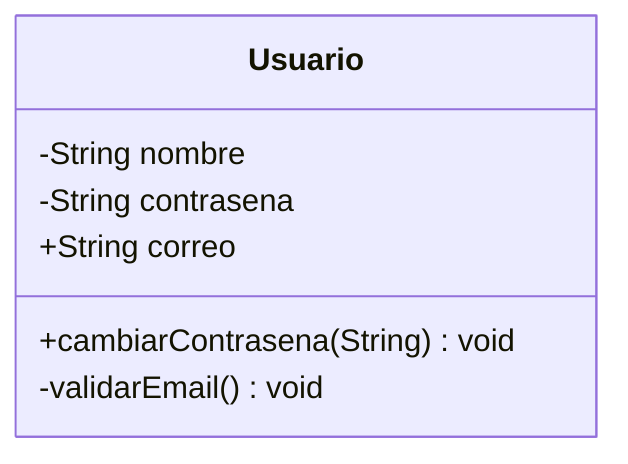
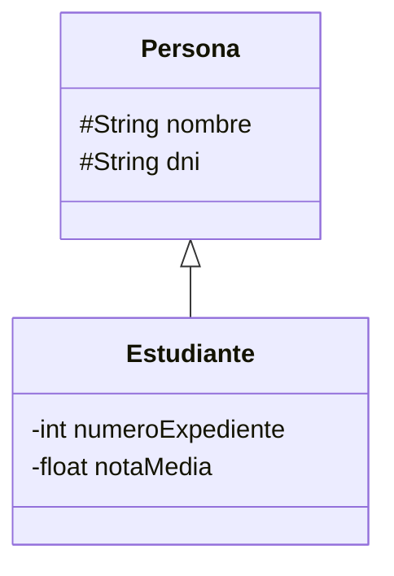
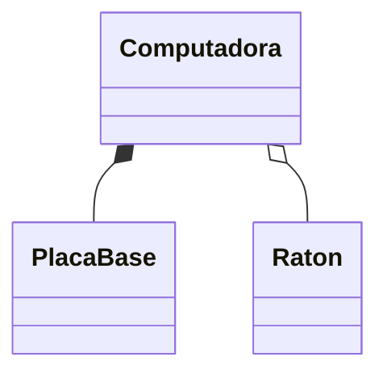
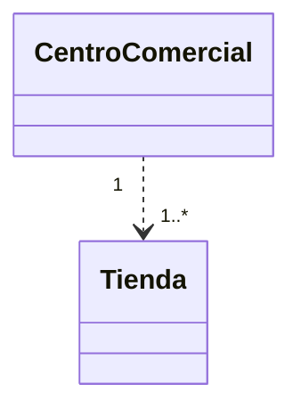
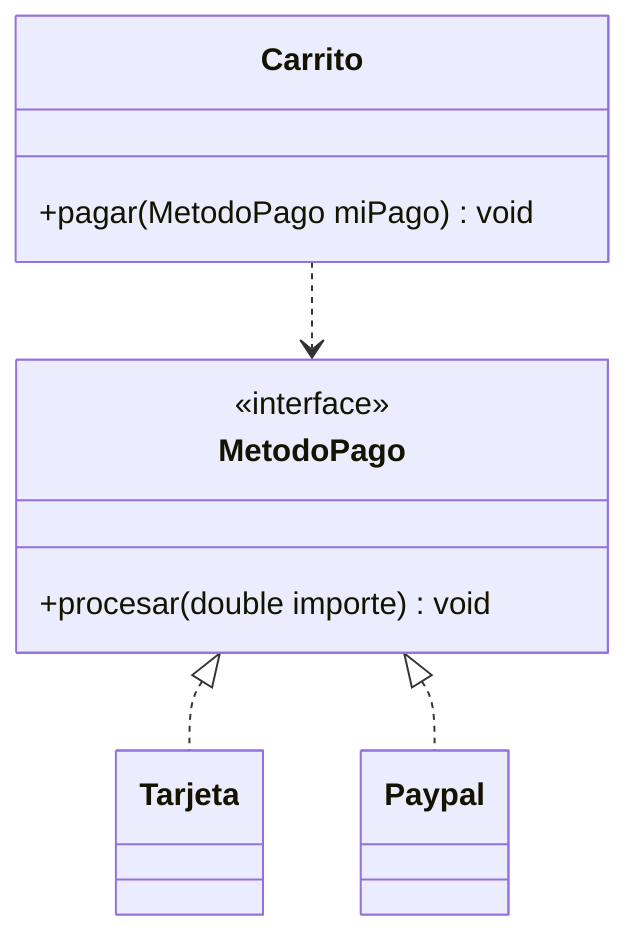
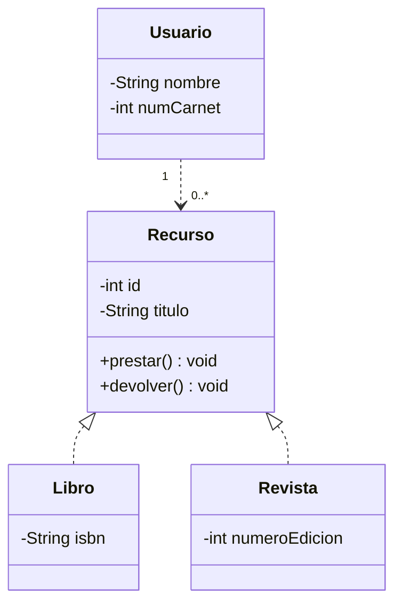

# Bateria_Ejercicios_6.2
#Ejercicio 01

``` mermaid
classDiagram

class Usuario{
     -String nombre
     -String contrasena
     +String correo
     +cambiarContrasena(String) void
     -validarEmail() void
}

```

#Ejercicio 02

``` mermaid
classDiagram
class Persona{
  #String nombre
  #String dni
} 
class Estudiante{
 -int numeroExpediente
 -float notaMedia
}

Persona <|-- Estudiante
```

#Ejercicio 03

```mermaid
classDiagram
    class Computadora

    class PlacaBase

    class Raton

    Computadora *-- PlacaBase 
    Computadora o-- Raton
```

#Ejercicio 04

``` mermaid
classDiagram
class CentroComercial
class Tienda

CentroComercial "1" ..> "1..*" Tienda
```

#Ejercicio 05

``` mermaid
classDiagram
class MetodoPago {
     <<interface>>
     +procesar(double importe) void
}

class Tarjeta{}

class Paypal{}

class Carrito{
     +pagar(MetodoPago miPago) void
}

MetodoPago <|.. Tarjeta
MetodoPago <|.. Paypal
Carrito ..> MetodoPago
```

#Ejercicio 06

``` mermaid
classDiagram
class Recurso{
     -int id
     -String titulo
     +prestar() void
     +devolver() void
}

class Libro{
     -String isbn
}

class Revista{
     -int numeroEdicion
}

class Usuario {
     -String nombre
     -int numCarnet
}

Recurso <|.. Libro
Recurso <|.. Revista

Usuario "1" ..> "0..*" Recurso
```
