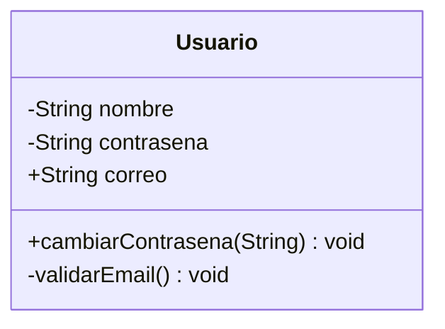
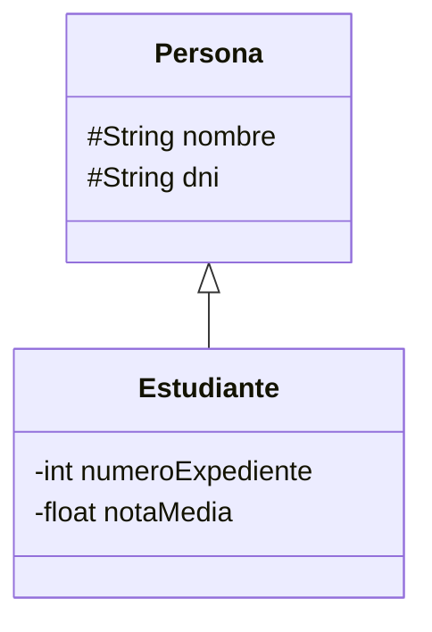
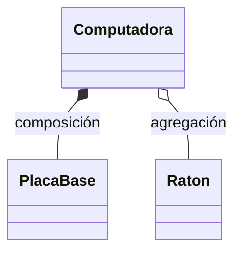

# Bateria_Ejercicios_6.2
#Ejercicio 01

``` mermaid
classDiagram

class Usuario{
     -String nombre
     -String contrasena
     +String correo
     +cambiarContrasena(String) void
     -validarEmail() void
}

```

#Ejercicio 02

``` mermaid
classDiagram
class Persona{
  #String nombre
  #String dni
} 
class Estudiante{
 -int numeroExpediente
 -float notaMedia
}

Persona <|-- Estudiante
```

#Ejercicio 03

```mermaid
classDiagram
    class Computadora

    class PlacaBase

    class Raton

    Computadora *-- PlacaBase : composición
    Computadora o-- Raton : agregación
```
